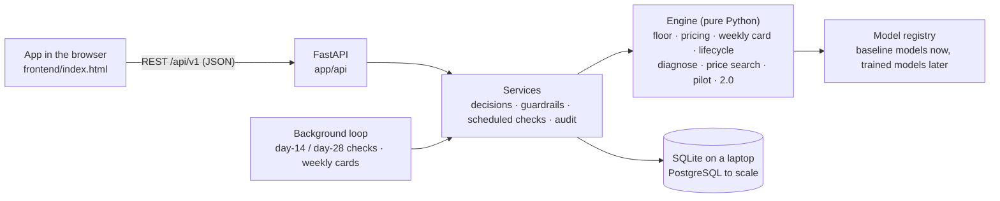

# ProfitPilot

**A pricing co-pilot for the new-to-online Meesho seller.** Built for the Meesho DICE Challenge Season 3, Business Track: *Pricing across a product's lifecycle: the new-to-online seller.*

ProfitPilot works out what one **kept** order really costs a seller (after returns and refused COD parcels), sets a safe first price with a dual price (easy returns / no returns), and re-decides the price at every point in the product's life. Before any discount it checks whether price is really the problem. Every suggestion comes with a **Why**: what to do, why (the signals, with numbers), the ₹ effect, the confidence, and how to undo it.

This repository is the complete package: a **Python backend** (REST API, database, scheduled checks, price-search engine) and the **mobile web app** that uses it. Run one command and your laptop becomes the server.

> **All numbers are illustrative.** They come from simulations and planning defaults, not from real Meesho data. This is a competition prototype, not an official Meesho product.

---

## Run it on your laptop

You need **Python 3.9 or newer** ([python.org](https://www.python.org/downloads/); on Windows tick *"Add python.exe to PATH"* during setup).

```bash
git clone https://github.com/Soham-Shah-20072004/ProfitPilot.git
cd profitpilot
python run.py          # on macOS / Linux you may need: python3 run.py
```

The first run creates a private Python environment in `.venv` and installs the requirements (about a minute). Then your browser opens:

| What | Where |
|---|---|
| The app | http://localhost:8000 |
| Interactive API docs (try every endpoint) | http://localhost:8000/docs |
| Health check | http://localhost:8000/api/v1/health |

Useful options:

```bash
python run.py --lan      # phones on the same Wi-Fi can open it too (the terminal prints a QR code)
python run.py --reset    # start again from fresh demo data
python run.py --port 9000
```

With Docker instead (API + PostgreSQL): `docker compose up`, then open http://localhost:8000.

---

## A 3-minute demo

1. **Home → Printed Kurti → "Step up ₹369 → ₹384" → YES.** The server re-checks the guardrails, publishes the price, and schedules two checks: day 14 (judge on orders) and day 28 (confirm on kept orders). Reload the page: the decision is still there, with Undo for 24 hours.
2. **Try a second move on the kurti.** The server refuses it: the 7-day cooldown is still running, and it tells you which rule failed.
3. **More → Server → "+14 days".** The demo clock moves forward. The day-14 check judges the move ("Kept ₹384: profit per impression +8.6%"), the weekly WhatsApp cards appear in the (simulated) outbox, and the audit log shows every step.
4. **Parity table (same screen).** The engine runs in Python on the server and in JavaScript in the app. Both agree to the rupee for every product.
5. **More → Engine lab → 30 days.** The price search runs on the server. One price menu is live per day for every buyer; the ₹369 / ₹339 menu wins most days, and ₹299 is never shown because it is below the floor.
6. **API docs → `GET /api/v1/products/kurti/lifecycle`.** The rival test: holding ₹384 earns ₹819 a day, matching at ₹369 earns ₹739 a day, so the engine holds.

The same `frontend/index.html` also works with no server at all (opened from disk or hosted on CodeSandbox). It then runs in offline demo mode and says so on the Server screen.

---

## How it works



* **Engine** (`app/engine/`): plain Python functions with no database or web code. Easy to test, easy to reuse in a batch job or a notebook.
* **Services** (`app/services/`): turn engine answers into actions: publish a price, refuse a move that breaks a rule, schedule and run checks, write the audit log.
* **API** (`app/api/`): versioned REST under `/api/v1`, documented automatically at `/docs`.
* **Models** (`app/ml/`): every model sits behind an interface, so a trained model replaces a baseline without touching the rules or the API.

### What each part of the engine decides

| Part | What it does | Key rule (illustrative numbers for the kurti) |
|---|---|---|
| Floor (`floor.py`) | Cost of one **kept** order: sourcing + packing + shipping + returns + RTO + other costs, spread over the orders that stay sold | ₹180 sourcing becomes a ₹309 floor; plus a ₹18 safety margin for uncertain return rates = ₹327 safe minimum |
| First price (`pricing.py`) | Start price = floor + the seller's target profit; dual price; market check | ₹309 + ₹60 = ₹369 (₹42 above the safe minimum); no-return price ₹339 (the ₹30 gap ≈ the return cost saved); warns if floor + profit is above the look-alike band |
| Weekly card (`recommend.py`) | One Yes / No suggestion per product per week, per goal mode (Cash, Growth, Margin, Clear) | Growth step +4% only if conversion held 2 weeks, stock ≥ 30 days, kept rate as assumed, no rival undercut |
| Guardrails (`pricing.py`, `services/decisions.py`) | Checked again on the server before anything is published | Never below the floor · ≤ 8% per move · 7-day cooldown · ≤ 2 moves a month · undo within 24 h · day-14 judge and day-28 confirm |
| Lifecycle (`lifecycle.py`) | Stage from kept units; rival test; markdown ladder; ways to exit stuck stock | Hold ₹384 = ₹819/day vs match ₹369 = ₹739/day → hold |
| Diagnose (`diagnose.py`) | 8 signals checked before any discount, price last | A signal must hold 2 weeks in a row (robust z-score vs similar products); conversion needs ≥ 300 clicks a week |
| Price search (`bandit.py`) | Thompson sampling over price **menus** | One menu per day for every buyer; menus below the floor are never shown; lift measured against holdout sellers |
| Pilot (`pilot.py`) | Sample size, seller-level randomisation, impact chains | n = 2(z<sub>α/2</sub> + z<sub>β</sub>)²σ²/δ² = 251 sellers per group → 50/50 pilot, then a permanent 5% holdout |
| 2.0 modules (`inventory.py`) | Opt-in tools beyond price | Reorder point 102, order ≈ 2 weeks of sales (170); pool 80+70+60+50+40 = 300 → ₹210 → ₹188; credit ≈ ₹34k |
| Coach (`coach.py`) | Hindi / English questions routed to engine answers | Every answer names its source; the Coach never changes anything by itself |

---

## Main API endpoints

Full, clickable list at **http://localhost:8000/docs**. Examples are in [`docs/API.md`](docs/API.md).

| Method | Path | What it does |
|---|---|---|
| GET | `/api/v1/health` | Is the server up |
| GET | `/api/v1/bootstrap` | Seller, products with live prices, active decisions (what the app loads) |
| GET | `/api/v1/recommendations` | This week's card for every product |
| POST | `/api/v1/decisions` | YES / NO on a card; a YES on a price move is re-checked against the guardrails |
| POST | `/api/v1/decisions/{key}/undo` | Undo within 24 hours |
| POST | `/api/v1/floor` · `/api/v1/first-price` | Floor and first price from raw inputs (no account needed) |
| GET | `/api/v1/products/{id}/lifecycle` | Stage, rival test, markdown ladder, exits, life story |
| POST | `/api/v1/products/{id}/metrics` | Ingest weekly funnel data; 8+ weeks re-classify the stage |
| POST | `/api/v1/diagnose` | 8-signal scan on your own numbers |
| POST | `/api/v1/experiments` → `/simulate` · `/choose` · `/outcomes` | Price search: demo simulation, or live (today's menu, then post outcomes) |
| POST | `/api/v1/pilot/sample-size` · GET `/api/v1/pilot/impact` | Pilot maths and illustrative impact chains |
| POST | `/api/v1/v2/reorder-point` · `/pool` · `/credit` · `/weight-audit` | 2.0 modules |
| POST | `/api/v1/coach/ask` | Ask in Hindi or English |
| GET | `/api/v1/jobs` · POST `/api/v1/admin/clock/advance` | Scheduled checks; demo time travel |
| GET | `/api/v1/audit` · `/api/v1/notifications` | Audit log; weekly WhatsApp outbox (simulated) |

---

## Models: what runs today and what comes next

The pilot needs four models: **floor, return risk, look-alikes, price search**. Today each slot runs a baseline that needs no training data; trained models plug into the same interface (`app/ml/interfaces.py`). `GET /api/v1/models` shows which one is active.

| Slot | Today | Next | Data it needs |
|---|---|---|---|
| Floor | Deterministic cost build | (no ML needed) | Seller costs, category priors |
| Demand / price sensitivity | β = −3 prior with a look-alike penalty, shrunk toward a learned β | LightGBM, monotone in price | Daily price, impressions, orders per listing, with price variation (the pilot creates it) |
| Return risk | Category prior + Beta-binomial update on matured orders | Per-pincode, COD vs prepaid classifier | Order outcomes with pincode, payment mode, size, reason codes |
| Look-alikes | Band stored on the product | CLIP image + title embeddings with attribute filters | Catalogue images, titles, attributes, live prices |
| Price search | Constrained Thompson sampling (learns online) | (already the production design) | Daily menu outcomes |

Two training scripts already run on the **synthetic** sample data in `data/sample/`:

```bash
python -m app.ml.training.train_elasticity     # learns β per category → models/elasticity.json
python -m app.ml.training.train_return_risk    # category return / RTO rates → models/return_rates.json
PP_USE_LEARNED_MODELS=true python run.py       # use the learned β instead of the −3 prior
```

The plans for the LightGBM and CLIP models are written up in `app/ml/training/`.

---

## Scaling it later

* **Database**: set `PP_DATABASE_URL` to PostgreSQL (the Docker setup already does). The test suite passes on SQLite and PostgreSQL.
* **API**: stateless, so it scales by running more workers behind a load balancer.
* **Jobs**: the checks are plain functions in `app/services/jobs.py`; move them from the built-in loop to a worker or a cron job.
* **Data in**: `POST /products/{id}/metrics` is the entry point for weekly funnel data; a stream (orders, returns, impressions) can feed the same tables.
* **Sign-in**: the demo uses the `X-Seller-Id` header (default `demo`) and an optional `X-API-Key`. In production this becomes the supplier-panel login.
* **Notifications**: the weekly WhatsApp outbox is simulated; connect it to a WhatsApp Business API sender.
* **Schema changes**: add Alembic migrations once the tables settle.

---

## Project layout

```
profitpilot/
├── run.py                 one-command launcher (venv, install, server, browser, --lan QR)
├── app/
│   ├── main.py            FastAPI app: /api/v1, /docs, serves the app at /
│   ├── api/               routes (core, engines, operations) and request schemas
│   ├── engine/            pure-Python pricing engine (ported from the app, parity-tested)
│   ├── services/          decisions + guardrails, scheduled checks, demo seed, demo clock, audit
│   ├── ml/                model interfaces, baselines, registry, training scripts
│   ├── models.py          database tables
│   └── cli.py             python -m app.cli recs | jobs | advance 14 | reset
├── frontend/index.html    the mobile web app (works with or without the server)
├── data/                  synthetic sample data + generator
├── tests/                 97 tests, incl. parity with the app's JavaScript engine
├── docs/                  architecture and API notes
├── Dockerfile, docker-compose.yml, .github/workflows/ci.yml
└── requirements.txt
```

## Tests

```bash
pip install -r requirements-dev.txt
pytest -q
```

`tests/test_parity.py` compares the Python engine with outputs captured from the app's own JavaScript (3 scenarios × 4 goal modes × 5 products, plus the lifecycle story), so the two can never drift apart silently.

## Settings

All optional; see `.env.example`.

| Variable | Default | Meaning |
|---|---|---|
| `PP_DATABASE_URL` | SQLite file `profitpilot.db` | Database connection |
| `PP_SEED_DEMO` | `true` | Create the demo seller and five products on first start |
| `PP_API_KEY` | empty | If set, write endpoints need `X-API-Key` |
| `PP_JOBS_INTERVAL_SEC` | `60` | How often due checks run (0 = off) |
| `PP_DEMO_CLOCK` | `true` | Allow demo time travel |
| `PP_USE_LEARNED_MODELS` | `false` | Use the learned β from `models/elasticity.json` |

---

*Meesho DICE Challenge S3 · Business Track · IIT Madras team. Illustrative numbers only; not affiliated with or endorsed by Meesho.*
