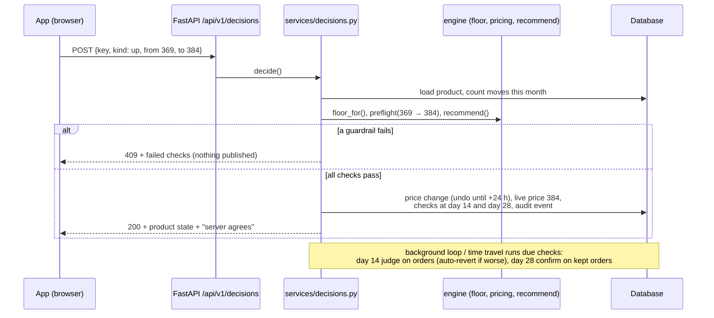

# Architecture notes

## Request flow: a seller taps YES on a price card

## Why the engine is a separate, pure package

* The same functions serve the API, the scheduled checks, the CLI and the tests.
* It is a line-by-line port of the app's JavaScript engine, and `tests/test_parity.py` checks both agree on every product and goal mode. JavaScript rounds halves up (`Math.round`), Python rounds them to even, so all rounding goes through `engine/fmt.js_round`.
* Moving it to a batch job (nightly re-pricing of the whole catalogue) needs no changes.

## Data model (tables)

| Table | Holds |
|---|---|
| `sellers` | goal mode, language, accepted wins (Autopilot unlocks at 4), pilot group |
| `products` | costs, market band, live price, demo signals, control mode, last move time |
| `price_changes` | every published move: from, to, status (live / undone / reverted / confirmed), undo deadline |
| `decisions` | every YES / NO with the card the seller saw |
| `scheduled_checks` | day-14 judge and day-28 confirm per price change, with the verdict |
| `experiments` | price-search state (posteriors, days per menu, random state) |
| `metric_weeks` | weekly funnel per product (production input for stage and Diagnose) |
| `audit_events` | append-only log of everything above |
| `notifications` | weekly WhatsApp card outbox (simulated) |
| `coach_messages` | questions asked to the Coach and the intent they were routed to |

## Guardrails (enforced on the server)

| Rule | Value | Why |
|---|---|---|
| Floor | never below F (recovery floor only at Exit, with consent) | every published price covers the cost of a kept order |
| Max step | 8% per move | buyers notice bigger jumps; keeps the elasticity estimate local |
| Cooldown | 7 days per product | one full weekday + weekend cycle |
| Stability | ≤ 2 moves a month | buyers and resellers who share links need to trust the price |
| Min data | 1,000 views (sanity check) | ≈ 5 orders: enough to see buyers order, not enough to measure price sensitivity |
| Undo | 24 hours | the seller stays in control |
| Auto-revert | judge at day 14, confirm at day 28 | orders react within days; returns arrive late |
| Fairness | one price menu for every buyer at any moment | price tests rotate by day; holdout is seller-level |

## Illustrative numbers

The five demo products, category priors and impact targets come from the team's deck and are illustrative. Replace them through the API (`POST /products`, `PATCH /products/{id}`, `POST /products/{id}/metrics`) or by editing `app/engine/catalog.py`.
